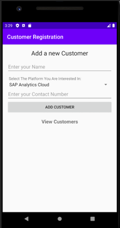
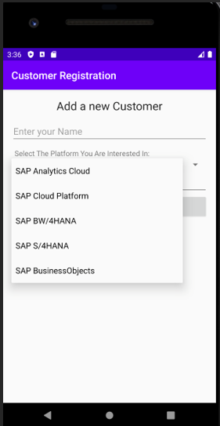
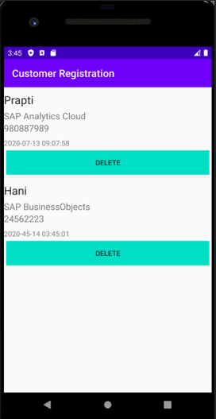
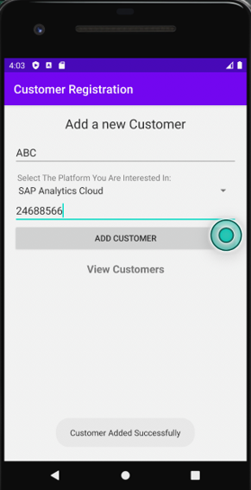
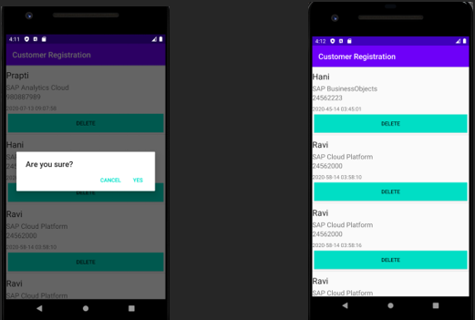

# Customer-Registration

## Introduction

This is a prototype of an android application that sends data to the in-built SQLite database provided by Android Studio. This data can then be ported to an SQLite browser/ any other local database or to an external database server such as MySQL This application offers two capabilities-

-	Inserting data into the SQLite Database
-	Viewing data present in the SQLite Database
-	Deleting data from the SQLite Database

## Task Performed

- Building the user-interface design

  - To build the user interface design we need three functionalities- EditText, Button, Spinner and some TextViews.

    A code is written in the activity_main.xml file which is the layout a user sees when they first open the application. In this case, I have included a message which says “Add a new customer” and asks for three fields: name, platform you are interested in and contact number with two buttons and a spinner in the platform     interested field.
    
    

  - For the spinner that we used in the above screen, we need to define an Array as the entries for the spinner. So go inside values and open strings.xml and modify it as per the entries you want to show to select the platform you are interested in. For this app, I have used the following entries
  
    

  - For viewing all the customers, we need another layout. First we create a blank activity in the java folder. An xml file is automatically created. In this xml we write the code for layout we want to view our list of employees in. I have used two xml files for this. One is a simple ListvView and the other is a custom ListvView to get the below output. 
  
    

- Coding the Application

  - Adding a customer- This operation is done inside the MainActivity.java file. 

    - I have used a method called openOrCreateDatabase() that takes three parameters- one of them being the database name which opens a database if it exists when the value is passed and if it does not exist, it simply creates a new database. Another method written is createCustomerTable( ) which is used to create the table using SQL query.

    - Now we call this method just after calling the openOrCreateDatabase() method. In the above method we are just calling the method execSQL() to create our database table. The execSQL() method takes String as a parameter and the String is actually the SQL query that we need to execute.
    
    - Now we need to insert the customer in the table and we do this inside add Customer() method.
    
    
    
  - Viewing a customer 
  
    - We do this operation inside CustomerActivity.java. But before fetching the customer, we need two more java classes to display customers in the list. 
    
    - The first class is a regular java class to store the customer e as an object and a CustomAdapter class for the ListView
    
    - •	After this we write a code in the CustomerActivity.java file. We will now be able to read our customers list
    
  - Deleting a customer
  
    - We will do the deletion also in the CustomerAdapter class. The operation is same we just need to change the SQL String to perform delete operation the rest part is exactly the same.
    
    - So to make the delete operation, we  modify the getView() of CustomerAdapter
    
    - In this application, we have created an option which asks if you are you want to delete customer and upon pressing yes, the customer will be deleted. In the image below, I am trying to delete the customer that reads “Prapti”.
    
    

